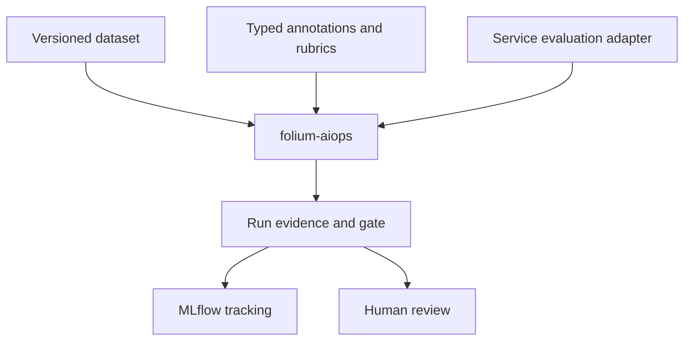

# Folium AIOps Architecture

## Purpose

Folium AIOps is the local-first evidence layer for agent, LLM, and traditional
ML systems. It manages versioned datasets, append-only annotations,
deterministic evaluations, run evidence, threshold gates, and MLflow tracking.
It is not a clinical workflow engine, provider abstraction, or autonomous
decision system.

## Ownership Boundaries



`folium-core` owns stable cross-service domain contracts and pure primitives,
such as `ChartReviewInput` and `ChartReviewOutput`. It must not own scorer
policy, MLflow dependencies, provider clients, or service prompt behavior.

`folium-aiops` owns reusable evidence mechanics:

- Dataset manifests, immutable versions, checksums, and fixture discovery.
- Typed append-only annotations with rubric and reviewer provenance.
- A generic lifecycle: load, invoke, score, persist case evidence, aggregate,
  and apply a versioned gate policy.
- Provider-neutral run records, metrics, artifacts, baseline selection, and
  MLflow tracking.

Services own their evaluation adapters and domain policies. Chart review owns
citations and retrieval rules; summarization owns its output rubric;
transcription owns word-error/redaction scoring; conventional ML owns
feature-schema, prediction metrics, and model-artifact policy.

## Initial Layout

```text
packages/folium-aiops/
  src/folium/aiops/
    datasets.py
    annotations.py
    contracts.py
    runner.py
    gates.py
    tracking/mlflow.py
services/eval_runner/
  src/eval_runner/
  datasets/
```

`services/eval_runner` is a thin executable consumer, not a central scoring
service. Confirm the package API with chart review and summarization before
expanding it for further services.

## Execution Model

The runner is environment-neutral: the identical versioned command can run on a
developer machine, by an on-demand pipeline dispatch, or as a required
prompt/model-change pipeline gate. Local execution is for authoring and quick
diagnosis; pipeline evidence is the durable pre-rollout record.

Pipelines provision or target a disposable non-production system, pass only the
approved evaluation identity and configuration references, invoke the staged
API adapter, publish MLflow artifacts, and report the versioned gate result.
They do not require a developer workstation, local Docker daemon, or manually
started model process. The dataset, rubric, gate policy, runner version, and
deployment revision are pinned in each run so prompt changes remain comparable.

## Guides

- [Offline Evaluation](aiops-offline-evaluation.md): repeatable pre-release
  qualification, staging API adapters, evidence, and performance baselines.
- [Online Evaluation](aiops-online-evaluation.md): asynchronous production
  observation, delayed labels, drift, shadow, and canary policies.
- [Chart-Review Evaluation](chart-review-evaluation.md): the native encounter
  fixture, workflow trigger/poll protocol, trace, and deterministic rubric for
  `ChartReviewBench-v1`.

## Pipeline Execution

The benchmark command accepts all runtime dependencies through explicit
configuration: target API URL, evaluation identity reference, dataset ID,
prompt/model revision, tracking URI, and timeout policy. It must not assume a
local Docker daemon, manually running model, developer database, or a fixed
endpoint.

Run it in three ways using the same immutable dataset and rubric:

- **Local:** author a fixture, diagnose a regression, or run deterministic
  adapter/scorer checks.
- **On demand:** dispatch an evaluation pipeline for a selected prompt, model,
  or deployment revision.
- **Required gate:** run the staged API benchmark after each prompt/model change
  and before its rollout is eligible.

The pipeline creates or targets a disposable non-production stack, waits for
its health checks, runs the synthetic fixture lifecycle, uploads case artifacts
and aggregate metrics to MLflow, and reports the gate result to the change.
Infrastructure credentials remain in the pipeline environment; the runner gets
only its dedicated evaluation identity and configuration references. A failed
or inconclusive run blocks promotion and retains artifacts for review.

## Dataset And Evidence Contract

A committed dataset has a manifest with ID, immutable version, schema version,
synthetic-data declaration, file list, and checksums. Cases hold service-owned
seed inputs and expected observable properties. Annotations are append-only:
each records its ID, rubric version, authoring identity, timestamp, status, and
superseded annotation when corrected.

Every case artifact records validated output or terminal failure, evidence IDs,
stage timings, score details, and run metadata. MLflow receives aggregate
metrics, tags, and artifact links; committed datasets and annotation revisions
remain the durable source of truth.

## Performance Baseline

Report per-run count, minimum, median, $p95$, maximum, validation failures, and
pass rate. Preserve provider wall-clock time separately from queue delay,
workflow time, runner overhead, parsing, and scoring. Establish an initial warm
sequential baseline with identical dataset, model/provider configuration, and
hardware metadata. A small correctness benchmark does not establish capacity or
throughput.

## Promotion Gate

The generic gate returns `pass`, `fail`, or `inconclusive` from versioned
threshold policy. It blocks a revision from promotion when evidence fails, but
never authorizes clinical action. Automated promotion, LLM-as-judge, and
statistical significance require separate approved policy.
