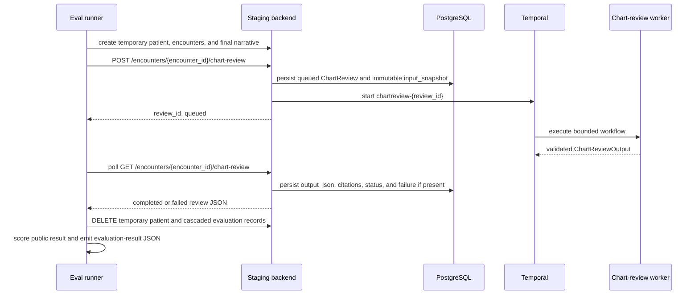

# Chart-Review Evaluation

## Scope

`ChartReviewBench-v1` is an anonymized, service-owned benchmark for bounded
chart-review draft support. It evaluates the staged system using native patient
and encounter records. The backend, rather than fixture YAML, derives the
immutable `ChartReviewInput` and canonical source IDs.

## Fixture Contract

```text
services/chartreview/evals/chart_review_bench/v1/
  README.md
  patient-001/case.yaml
```

Each short `patient-###` case folder declares one anonymized patient, exactly one
active encounter, and zero or more chronological prior encounters. The active
encounter key, expected summary facts, preserved missing information, source-role
assertions, retrieval-decision assertions, expected follow-up questions, and
expected validation state live in `case.yaml`. YAML uses stable roles such as
`active.note` and `prior-001.description`. A future restricted evidence endpoint
will resolve those roles to canonical source IDs for exact provenance scoring.

The evaluator uses the public API to create an isolated temporary patient and
its native records. The patient medical-record number includes a unique random
suffix; it is not a committed benchmark identity. The runner always deletes the
temporary patient in its cleanup path after it has received a terminal chart
review response. The database therefore holds the input and final output while
the workflow runs, but does not retain completed local evaluation patients or
their related encounters/reviews after cleanup.

`app/evals.py` rejects duplicate encounter keys, a missing or non-final active
encounter, non-chronological fixture encounters, and source-role assertions for
unpopulated fields before the runner calls the API.

## Initial Cases

`patient-001` is an anonymized 14-year-old's fall cough-and-fever encounter. The
active encounter supplies cough, fever, nasal congestion, and a cold-air trigger
but leaves symptom onset and fever duration unknown. It tests that the agent
avoids redundant retrieval, preserves those gaps, and asks follow-up questions
without assigning a cause for the cough or fever.

`patient-002` is an anonymized 73-year-old's multi-encounter review with
documented diabetes. The active encounter is triggered by abnormal
blood-pressure readings and elevated glucose, but lacks both a current
medication list and diagnostic assessment. Several prior encounters supply
common outpatient context, but only a prior medication-reconciliation source
is relevant to the missing medication list. It tests grounded term selection,
bounded retrieval, exact source-role citation, clear separation of active and
historical facts, and follow-up questions for remaining gaps. The output may
identify that the current regimen needs assessment for possible reduced
effectiveness; it does not diagnose, recommend treatment, or act autonomously.

## Workflow Protocol



The runner does not start Temporal directly. It triggers
`POST /api/v1/encounters/{encounter_id}/chart-review` using a dedicated
evaluation identity, then bounded-polls the matching `GET` endpoint. The
backend owns review creation, immutable source selection, the workflow ID, and
final persistence. `completed`, `failed`, and poll timeout are explicit case
observations; the runner never retries by submitting another review.

## Run A Benchmark Suite

With the local backend, Temporal, chart-review worker, and inference provider
running, execute every `patient-###/case.yaml` sequentially with:

```bash
uv run --package chartreview chartreview-eval \
  services/chartreview/evals/chart_review_bench/v1
```

Pass an individual `case.yaml` to run one case. The CLI prints one aggregate
JSON document containing ordered per-case results and exits nonzero when any
case fails. Sequential execution preserves comparable elapsed-time evidence
for the local provider.

## Persisted Review And Evaluation Result

The backend persists a queued `ChartReview` before it dispatches Temporal. Its
`input_snapshot` is a JSON serialization of the backend-created `ChartReviewInput`.
The snapshot contains patient and encounter identifiers, the complete selected
active encounter context, and canonical source IDs. For the active encounter,
the backend includes populated title, summary, description, chief complaint,
clinical assessment, treatment plan, structured summary, and the latest final
`EncounterNarrative`. The final narrative is the primary current-state source;
the other populated encounter fields are supporting current context.

When the workflow completes, the backend validates the worker's
`ChartReviewOutput`, then persists `output_json`, `confidence`, optional
`review_flags`, `provider_name`, cited source IDs, and terminal status. On
workflow dispatch, execution, or result-read failure, it persists `failed` and
`failure_message`. The public `GET /api/v1/encounters/{encounter_id}/chart-review`
response returns a safe projection of this stored review: summary, reasoning,
missing information, follow-up questions, display-only source metadata,
confidence, review flags, and terminal failure message. It intentionally omits
canonical source IDs.

The CLI prints a separate evaluation-result JSON object to stdout. It is not
currently stored as a run artifact. Its shape is:

```json
{
  "case_id": "cough-and-fever-redundant-history-request",
  "passed": false,
  "failures": [
    "summary did not preserve required fact: Nasal congestion is present."
  ],
  "review_status": "completed",
  "elapsed_seconds": 39.678,
  "review": { "status": "completed" }
}
```

`review` contains the complete public response received before cleanup.
`failures` are deterministic evaluator findings, so a completed review can
still fail the benchmark. The CLI exits nonzero for benchmark failures, which
is distinct from a workflow or infrastructure error.

## Implemented And Deferred Evidence

Implemented public-result scoring detects:

- terminal review status;
- missing required active-context facts;
- missing declared information gaps;
- total client-observed case elapsed time.

The public response's `contentRole` is display metadata, not an evaluator
provenance contract. The E2E runner does not translate fixture roles such as
`active.note` into display strings such as `voice-note transcript`, and does
not make a pass/fail decision from that mapping. Exact required and forbidden
source-role scoring is deferred to restricted evaluation evidence, where fixture
roles can be resolved against canonical persisted source IDs.

The first live `patient-001` run identified a native-context defect: the backend
read the obsolete `encounter.note` field instead of `encounter.narratives`, so
the active narrative never reached the worker. The repaired snapshot includes
the latest final narrative and the other populated native encounter fields.
Intermittent title-for-narrative citation remains observed provenance behavior
for the future restricted-evidence benchmark, not a public-result failure
category.

The following restricted evidence capability is planned, not implemented:

The public response intentionally hides canonical source IDs. A non-production
endpoint, `GET /api/v1/internal/evaluation/chart-reviews/{review_id}`, therefore
returns only for anonymized evaluation-eligible reviews and the evaluation
identity. It assembles the immutable snapshot, canonical persisted output and
citations, ordered stage trace, and terminal status/failure after the public
lifecycle is terminal.

### Retrieval Evaluation Boundary

Input and output snapshots alone cannot evaluate retrieval. They show what the
agent received initially and what it finally cited, but not whether the history
decision was necessary, which search terms it selected, what the backend matched,
or which retrieved blocks were available to generation.

The evaluator remains outside the system: it seeds through public APIs, triggers
the ordinary chart-review endpoint, polls the ordinary public result, then reads
one restricted anonymized-evaluation evidence record. The workflow itself creates that
record as an audit trace; the evaluator does not replace or intercept agent
calls.

Pass `review_id` through graph state. At the existing workflow boundaries,
activities append typed, safe events through an authenticated internal backend
endpoint:

- `history_decision`: selected `search_terms`, elapsed time, and validation outcome;
- `history_retrieval`: requested terms, returned canonical source IDs, count,
  bounded no-match outcome, and elapsed time;
- `generation`: source IDs available to final generation and elapsed time;
- `validation`: output validation outcome, canonical cited source IDs, and
  bounded failure category.

Events do not copy broad source content. The immutable `input_snapshot` gives
the initial source IDs, the retrieval event gives additional source IDs, and the
persisted output gives citations. The external evaluator can then determine
whether retrieval was unnecessary, whether its terms target a declared gap,
whether returned sources match permitted fixture roles, whether a no-match
preserved the gap without invention, and whether final citations were made from
sources actually available to generation. The backend rejects trace writes and
reads for ordinary or production reviews.

## Deterministic Rubric

The implemented public-result rubric scores expected-fact completeness,
preserved missing information, terminal status, and elapsed time. It includes a
small, documented lexical-equivalence set for
approved wording variants such as `onset`/`duration` and
`trigger`/`exacerbate`; it does not infer clinical facts.

Exact source references, unsupported-claim analysis, expected follow-up-question
quality, output-validation stage failures, history-decision terms, returned
history blocks, stage durations, and retrieval-term quality require the planned
restricted evidence endpoint. A no-match retrieval will be valid when it
preserves a declared factual gap for human review.

The golden case confirms active encounter note facts do not cause redundant
history lookup; it catches citation of an unsupplied prior encounter
`description` when only the allowable source was supplied; and it requires
actionable follow-up questions for declared symptom gaps.
Confidence scoring remains owned by task #40.
