# Chart Review Agent Service

Dedicated Temporal and LangGraph worker for synthetic chart-review draft support.

The backend assembles a validated, traceable patient-context bundle and persists
terminal review states. This service runs the bounded agent workflow and returns
structured draft-support output. It does not make clinical decisions,
recommendations, or autonomous actions.

## Current Workflow

1. A clinician explicitly requests a draft from an interaction.
2. The backend validates the patient and interaction, persists a queued review,
   and starts a Temporal workflow with an immutable active-interaction snapshot.
3. The LangGraph worker runs one `retrieve_history` node as a Temporal Activity.
   It calls a backend-owned internal endpoint for at most three approved prior
   interaction blocks. The worker has no database credentials, SQL access,
   document access, or unrestricted chart-search capability.
4. The `generate_review` node runs as a Temporal Activity. It sends the active
   snapshot and separately labelled prior context to the configured local
   OpenAI-compatible inference service.
5. The worker validates the provider response as `ChartReviewOutput`. Citations
   must exactly match supplied canonical source IDs, and confidence must be one
   of `low`, `medium`, or `high`.
6. The backend persists either the validated completed draft and citations or an
   explicit failed review. The clinician UI polls this persisted lifecycle and
   never displays partial model output.

```mermaid
flowchart LR
	 C[Clinician request] --> B[Backend snapshot and queued review]
	 B --> T[Temporal workflow]
	 T --> H[LangGraph history retrieval Activity]
	 H --> R[Bounded backend prior-interaction blocks]
	 R --> G[LangGraph generation Activity]
	 G --> M[Local OpenAI-compatible model]
	 M --> V[Output and citation validation]
	 V --> P[Persist completed draft or failure]
```



## Boundaries

- Synthetic data only.
- The active interaction snapshot is immutable for a review request.
- The backend controls source selection and access policy.
- The worker validates canonical citations rather than inferring missing source
  blocks from an interaction ID.
- `missing_info` identifies gaps for clinician review. It does not trigger more
  retrieval or a follow-up action.

## Run

```bash
cd services/chartreview
uv run python -m app.worker
```

For the complete local stack, use the repository Compose configuration. The
worker requires the configured inference endpoint, backend URL, and internal
service token; it fails at startup when required configuration is missing.

## Responsibilities

- Register the chart-review graph through Temporal's `LangGraphPlugin`.
- Run the bounded history lookup and provider nodes as Temporal Activities.
- Validate structured output before returning it to the backend.
- Keep source references traceable to the input bundle.

## Expansion Path

The current graph is intentionally fixed: retrieve a small approved history
block once, then generate one draft. Making it more agentic should mean adding
constrained decisions, not granting broad chart access or autonomous authority.

A future graph may evaluate a `missing_info` item and choose whether to request
one additional typed retrieval block. That decision must be bounded by a
backend-owned policy that defines allowed source types, the maximum number of
retrieval rounds, and explicit stop conditions. The backend should return only
the approved immutable blocks and keep an audit record of each request.

The graph can then route between `review context`, `request approved block`, and
`produce draft`, while Temporal continues to provide durable execution, retries,
and observable terminal outcomes. Final output validation, exact citation
allowlisting, and human review remain required at every level of capability.
